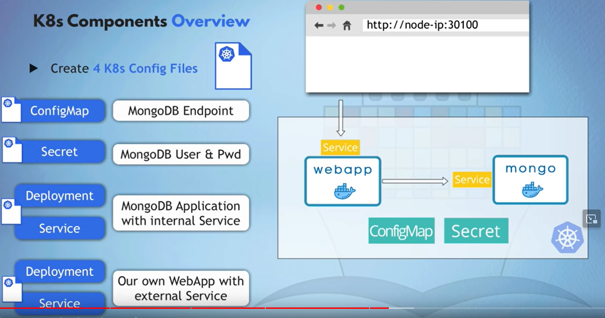

# Demo Project.

Sourced from a Youtube tutorial : https://www.youtube.com/watch?v=s_o8dwzRlu4

Demo project architecture : 

we refer to kubernetes documentation for building components.
<https://kubernetes.io/docs/home/>

### components that are going to be built : 

ConfigMap : <https://kubernetes.io/docs/concepts/configuration/configmap/>

Secret : <https://kubernetes.io/docs/concepts/configuration/secret/>

Deployment and Service for the DB 
<https://kubernetes.io/docs/concepts/workloads/controllers/deployment/>
<https://kubernetes.io/docs/concepts/services-networking/service/>

    MongoDB image : <https://hub.docker.com/_/mongo>

Deployment and Service for the WebApp
k8s doc same as the ones used for mongodb above
    
    WebApp image : <https://hub.docker.com/r/nanajanashia/k8s-demo-app>

set environment variables for mongo.yaml 
---
        env:
        - name: MONGO_INITDB_ROOT_USERNAME
          valueFrom :
            secretKeyRef:
              name : mongo-secret
              key : mongo-user
        - name : MONGO_INITDB_ROOT_PASSWORD
          valueFrom :
            secretKeyRef:
              name : mongo-secret
              key : mongo-password
---

make the webapp use the mongodb
---
    env:
      - name: USER_NAME
        valueFrom :
          secretKeyRef:
            name : mongo-secret 
            key : mongo-user
      - name : USER_PWD
        valueFrom :
          secretKeyRef:
            name : mongo-secret
            key : mongo-password
      - name : DB_URL
        valueFrom :
          configMapKeyRef:
            name: mongo-config
            key: mongo-url
---

make the webApp service External Service, which will make the app accessible using <nodeIP>:<nodePort>
also, nodePort range is defined in k8s, it has to be between 30000 - 32767
---
    apiVersion: v1
    kind: Service
    metadata:
    name: webapp-service
    spec:
    type: NodePort
    selector:
        app: webapp
    ports:
        - protocol: TCP
        port: 3000
        targetPort: 3000
        nodePort: 30001
---

### Now heading to actually deploying this app on K8s

checking nodes and pods 
---
    kubectl get node
    kubectl get pod
---

apply the config files 
---
    kubectl apply -f mongo-config.yaml
    kubectl apply -f mongo-secret.yaml
    kubectl apply -f mongo.yaml
    kubectl apply -f webapp.yaml
---

check all the components deployed in the cluster 
---
    kubectl get all
    kubectl get configmap
    kubectl get secret
---

had an issue with webapp : CreateContainerConfigError
---
    kubectl describe pod/webapp-deployment-b55c9d7f7-fjzrl
---

found out the issue with mongo-config, and re-applied with 
---
    kubectl apply -f mongo-config.yaml
    kubectl apply -f webapp.yaml
---

all looks ok now with 
---
    kubectl get all
---

to check logs 
---
    kubectl logs pod/webapp-deployment-b55c9d7f7-fjzrl
---

to access the application 
---
    minikube ip
---

or
---
    kubectl get node
    kubectl get node -o wide
---

to access the webapp from browser : 
---
    minikube service list
    minikube service webapp-service --url
---

or we can just open it from the terminal 
---
    minikube service webapp-service
---

take the url from here and access from website.

Done!
