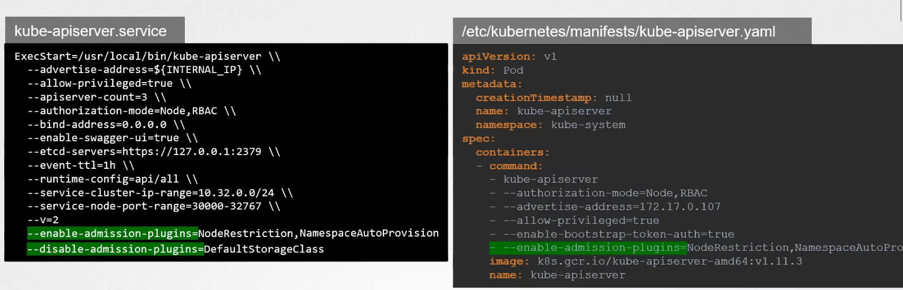

# admission controller

An admission controller is a piece of code that intercepts requests to the Kubernetes API server prior to persistence of the object, but after the request is authenticated and authorized.

Admission controllers may be validating, mutating, or both. Mutating controllers may modify related objects to the requests they admit; validating controllers may not.

    kubectl exec kube-apiserver-controlplane -n kube-system -- kube-apiserver --enable-admission-plugins=NamespaceLifecycle,LimitRanger ...

    kubectl exec kube-apiserver-controlplane -n kube-system -- kube-apiserver --disable-admission-plugins=PodNodeSelector,AlwaysDeny ...

To see which admission plugins are enabled:

    kubectl exec kube-apiserver-controlplane -n kube-system -- kube-apiserver -h | grep enable-admission-plugins

Since the kube-apiserver is running as pod you can check the process to see enabled and disabled plugins.

    ps -ef | grep kube-apiserver | grep admission-plugins

In Kubernetes 1.28, the default ones are:

CertificateApproval, CertificateSigning, CertificateSubjectRestriction, DefaultIngressClass, DefaultStorageClass, DefaultTolerationSeconds, LimitRanger, MutatingAdmissionWebhook, NamespaceLifecycle, PersistentVolumeClaimResize, PodSecurity, Priority, ResourceQuota, RuntimeClass, ServiceAccount, StorageObjectInUseProtection, TaintNodesByCondition, ValidatingAdmissionPolicy, ValidatingAdmissionWebhook



## Types of Admission Controller

### Validating

### Mutating

### A combination of Mutating AND Validating

    the order of execution would be Mutating first and then Validating 

### Dynamic Admission Control

We can configure these webhooks to point to a server that's hosted either within the Kubernetes cluster or outside it, and our server will have our own admission webhook service running with our own code and logic.

And then once it hits the webhook, it makes a call to the admission webhook server bypassing in an admission review object in a JSON format. This object has all the details about the request such as the user that made the request, and the type of operation the user is trying to perform, and on what object and the details about the object itself. On receiving the request,the admission webhook server responds with an admission review object with a result of whether the request is allowed or not.If the allowed field in the response is set to true then the request is allowed, and if it's set to false it is rejected.

the communication between the webhook server and the API server needs to be over TLS and hence it needs to be provided with a CA bundle, so a certificate bundle should be configured. So the server has to be configured with a pair of certificates. Then a CA bundle is to be created and passed into this client config SSEA bundle.

Things we need:

1. Webhook server - deployed either in the cluster or outside
2. Service for the webhook server
3. a tls secret for the server to communicate
4. wehook configuration - to list the rules based on which the webhook server is invoked.

#### Mutating Admission Webhook

when the Webhook API Server is hosted outside the cluster

```yaml
apiVersion: admissionregistration.k8s.io/v1
kind: MutatingWebhookConfiguration
webhooks:
- name: my-webhook.example.com
  clientConfig:
    url: "https://my-webhook.example.com:9443/my-webhook-path"
```

when the Webhook API Server is hosted inside the cluster, who's service is my-service-name

```yaml
apiVersion: admissionregistration.k8s.io/v1
kind: MutatingWebhookConfiguration
webhooks:
- name: my-webhook.example.com
  clientConfig:
    caBundle: <CA_BUNDLE>
    service:
      namespace: my-service-namespace
      name: my-service-name
      path: /my-path
      port: 1234
```
#### Validating Admission Webhook

```yaml
kind: ValidatingWebhookConfiguration
```


